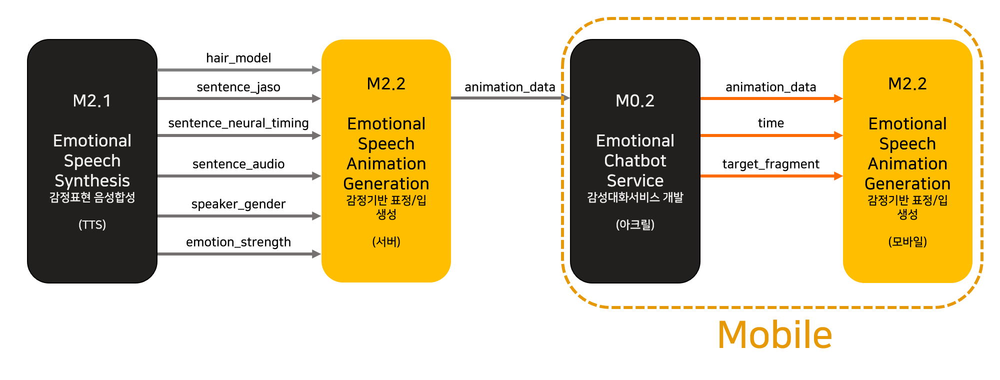
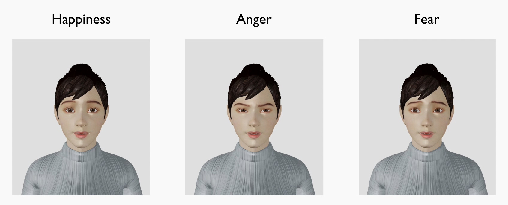

# Emotional Facial Animation - Android
This is the part of Emotional Facial Animation module for Flagship project by [Visual Media Lab, KAIST](http://vml.kaist.ac.kr).

***

## Note

* (2020/04/29) 4월 5차년도 베이스 코드 업데이트 되었습니다.

***

## System/SW Overview

* 본 시스템은 감정 기반 표정/입 생성 모듈의 모바일(안드로이드) 부분에 해당하며, 서버로부터 받은 3D 얼굴 애니메이션 시계열 데이터를 이용해 감정 표현 스피치 애니메이션을 렌더링하는 시스템입니다. 
* 아래 그림은 렌더링된 예시 이미지입니다.


***

## How to Install

- Getting started
  - Clone this repository.
  - Copy the `vml-animation.aar` file into the `app/libs` folder in your Android project.
  - In your `build.gradle` file, add following codes.

  ```
  dependencies {
      implementation(name: 'vml-animation', ext: 'aar')
  }  
  
  repositories {
      flatDir {
          dirs 'libs'
      }
  }
  ```
  - Sync the project.

***

## Main requirement

* OS: Android 8.0
* Language: Java 8
* Framework : OpenGL ES
* 서버 – 클라이언트 간 작동 : 안드로이드 앱 내에서 사용 가능한 Java 함수 제공

***

## Network Architecture and features

* 해당 사항 없음

***

## Quick start

- ### How to use the library

  - Create a new fragment(Containers) in your `.xml` layout and connect it with `vml.com.animation.AvatarFragment`.

  - In Activity, follow these steps.  
    (We provide `MainActivity.java` for testing and showing how to use in the activity.)  

  - Get the fragment manager of the AvatarFragment.  

    ```
    AvatarFragment fragment = (AvatarFragment) getFragmentManager().findFragmentById(..);
    ```

  - Create `AvatarAnimation` instance with the fragment.  

    ```
    AvatarAnimation avatarAnimation = new AvatarAnimation(fragment);
    ```

  - If a new animation data `.xml` is given from the server, set the animation.  

    ```
    avatarAnimation.setAnimation(..);
    ```

  - Play a new audio corresponding to the animation.  

  - While playing the audio, update the animation by getting the current audio timing.  

    ```
    avatarAnimation.updateAnimation(MediaPlayer.getCurrentPosition());
    ```

  - Finally, when the audio ends, play idle motion.  

    ```
    avatarAnimation.playIdleMotion();
    ```

- ### How to run the example codes

  - In `app/build.gradle` file, follow the steps.
  - Change `apply plugin: 'com.android.library'` to `apply plugin: 'com.android.application'`.
  - Delete the comment for `applicationId "vml.com.animation"`.
  - Delete the following codes.

  ```
  libraryVariants.all { variant ->
      variant.outputs.all { output ->
          if (outputFile != null && outputFileName.endsWith('.aar')) {
              outputFileName = "vml-animation.aar"
          }
      }
  }
  ```

  - Sync the project and run 'app'.


***

## HTTP-server API description

* 해당 사항 없음

***

## Repository overview

* `main\java\vml\com\animation\` 애니메이션 구동 관련 코드 포함
  * `MainActivity.java` 안드로이드 메인 어플리케이션 구동 코드
* `main\java\vml\com\vm\avatar\` 아바타 관련 코드 포함
  * `VMAvatar.java` 가상 아바타 클래스
  * `VMAvatarLoader.java` 가상 아바타 로더
* `main\java\vml\com\vm\blend\` 블렌드쉐입 관련 코드 포함
  * `VMBOLoader.java` 
    * `ObjMaterial` 렌더 메터리얼과 OBJ포맷의 스타일 정보 포함
    * `VMBOLoader` BO 모델 로더
* `main\java\vml\com\vm\utils\` 유틸리티 코드 포함
  * `FacePose.java` 얼굴 표정을 위한 블렌드쉐입 및 입 모양 데이터 포함
  * `FPSCounter.java` 프레임 카운트를 계산하는 클래스
  * `KeyFrame.java` 키프레임 데이터 구조 포함
  * `KeyFrameComparator.java` 키 타이밍에 맟추어 키프레임을 재구성하는 클래스
  * `VMMaterial.java` 모델의 재질 데이터 구조 포함
  * `VMShaderUtil.java` 쉐이더 사용을 위한 쉐이더 유틸리티
* `main\assets\Data` 렌더링 및 애니메이션에 사용되는 데이터 포함
